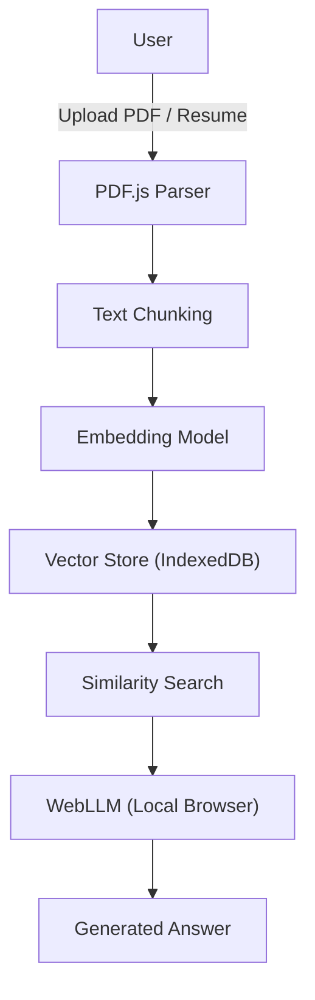

# Project Architecture

## RAG Pipeline
- Upload PDFs / Markdown files
- PDF.js extracts raw text
- Text is split into overlapping chunks
- Each chunk is embedded using the `all-MiniLM-L6-v2` model via ONNX Runtime Web
- Embeddings are stored in IndexedDB (Dexie)
- At query time, the user question is embedded and nearest neighbours are retrieved
- Retrieved chunks are fed into WebLLM to produce an answer with citations

## ATS Pipeline
- Upload resume (PDF/DOCX) and job description
- Text is parsed with PDF.js (or plain text for DOCX)
- Keyword extraction using the same embedding model
- Cosine similarity between resume keywords and job description keywords yields a deterministic score
- Optionally, WebLLM provides improvement suggestions

## Components
- **IndexedDB** – persistent client‑side vector store
- **WebLLM** – runs Qwen2‑0.5B‑Instruct entirely in the browser
- **Browser** – the whole stack executes in a modern browser with WebGPU/WebGL support
